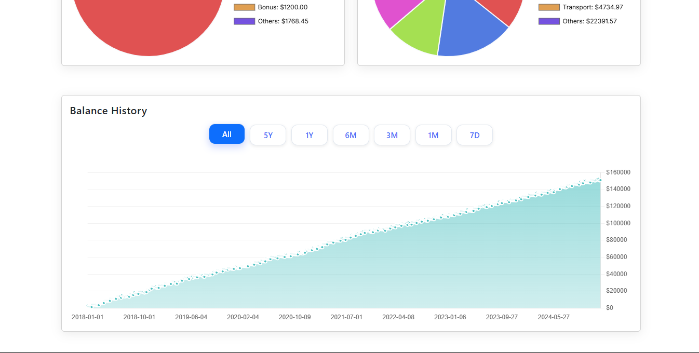

# FiscalFox - Personal Finance Manager

A Full-stack Personal Finance Management application with user authentication, transaction tracking, income and spending visualization and financial insights.

## Demo
[](https://youtu.be/OEfelcTyeyQ)


## Features

- **User Authentication**
  - Secure JWT-based login/signup
  - Protected routes
  - Session persistence

- **Transaction Management**
  - Add income/expense transactions
  - Import data by uploading csv
  - Edit existing transactions
  - Delete transactions
  - View transaction history
  - Sort transactions list by different parameters

- **Financial Dashboard**
  - Income vs. expense visualization
  - Category breakdown (pie charts)
  - Summary cards (income, spending, surplus, deficit)
  - Saving/Debt chart over a period of time

- **Technical Highlights**
  - Java Spring Boot backend with JPA/Hibernate
  - React frontend with Vite
  - PostgreSQL database
  - Responsive design
  - Secure API endpoints

## Tech Stack

**Frontend:**
- React
- Vite
- React Router 6
- React-Bootstrap
- Chart.js
- Axios

**Backend:**
- Java 17
- Spring Boot 3.5
- Spring Security
- JWT Authentication
- PostgreSQL
- Hibernate

## Screenshots





## Installation

### Prerequisites
- Java 17
- Node.js 18+
- PostgreSQL 12+
- Gradle 7+

### Backend Setup
1. Create PostgreSQL database:
```sql
CREATE DATABASE fiscalfox;
```
```bash
psql -U postgres -d fiscalfox -f ./backend/schema.sql
```

2. Configure `application.properties`:
```properties
server.port=9090
spring.datasource.url=jdbc:postgresql://localhost:5432/fiscalfox
spring.datasource.username=<YOUR DB USERNAME>
spring.datasource.password=<YOUR DB PASSWORD>
spring.jpa.hibernate.ddl-auto=update
spring.jpa.properties.hibernate.dialect=org.hibernate.dialect.PostgreSQLDialect

app.jwtSecret=your-strong-secret-key-with-at-least-32-characters-that-nobody-knows
app.jwtExpirationMs=86400000
server.address=0.0.0.0
```

3. Run the backend:
```bash
cd backend
./gradlew bootRun
```

### Frontend Setup
1. Configure environment:
```bash
cd frontend
echo "VITE_API_BASE_URL=http://localhost:9090/api" > .env
```

2. Install dependencies and run:
```bash
npm install
npm run dev
```

## API Endpoints

| Method | Endpoint               | Description                     |
|--------|------------------------|---------------------------------|
| POST   | /api/auth/signin       | User login                      |
| POST   | /api/auth/signup       | User registration               |
| GET    | /api/transactions      | Get all transactions            |
| POST   | /api/transactions      | Create new transaction          |
| PUT    | /api/transactions/{id} | Update transaction              |
| DELETE | /api/transactions/{id} | Delete transaction              |

## Project Structure

```
fiscalfox/
├── backend/            # Spring Boot application
│   ├── src/
│   │   ├── main/
│   │   │   ├── java/com/fiscalfox/backend/
│   │   │   │   ├── config/       # Security config
│   │   │   │   ├── controller/   # API controllers
|   |   |   |   ├── dto/          # Login Requests
│   │   │   │   ├── entity/       # JPA entities
│   │   │   │   ├── repository/   # JPA repositories
│   │   │   │   ├── security/     # JWT utils
│   │   │   │   └── service/      # Business logic
│   │   │   └── resources/        # Properties files
│   └── build.gradle              # Build config
│
└── frontend/           # React application
    ├── src/
    │   ├── components/ # Reusable components
    │   ├── context/    # React contexts
    │   ├── pages/      # Application pages
    │   ├── services/   # API services
    │   └── utils/      # Utility functions
    ├── .env            # Environment variables
    └── vite.config.js  # Vite config
```

## Contributing

1. Fork the project
2. Create your feature branch (`git checkout -b feature/AwesomeFeature`)
3. Commit your changes (`git commit -m 'Add an awesome feature'`)
4. Push to the branch (`git push origin feature/AwesomeFeature`)
5. Open a Pull Request

## License

Distributed under the MIT License. See `LICENSE` for more information.

## Contact

Jay Conar - jayconar@hotmail.com

Project Link: [https://github.com/jayconar/FiscalFox](https://github.com/jayconar/FiscalFox)